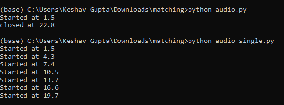

# Sound Detection using Template Matching
This repo aims to provide starter code for sound detection i.e detection of sound effect in anothersound file, using template matching based approach, there are 2 files audio.py and audio_single.py, audio.py detects ending and the starting of the cycles if sound effects occur in cycles While audio_single.py is more suited if sound effects occur in non cyclic fashion. It is recommended to use the audio_single.py if the audio effects are non cyclic in nature as detecting cycles comes at the cost of error in predicting the end of cycle(error is approximately equal to the length of the time period of the repetion)

# Example of working

# Libraries
Numpy

Librosa
